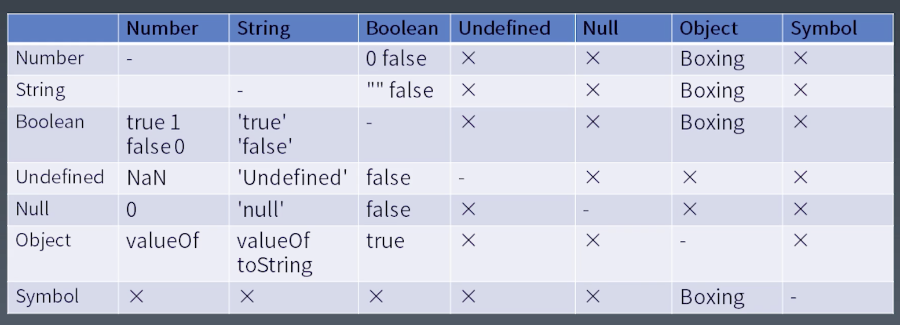
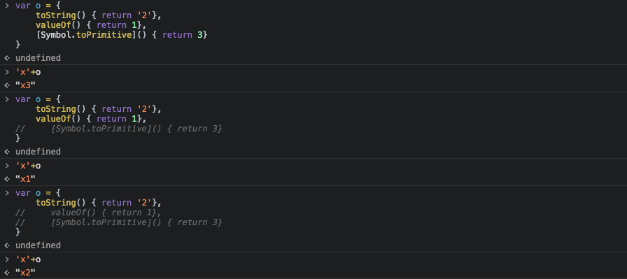

# 目标

语法树与优先级的关系；

## Expressions

### Member

- a.b
- a[b]——支持运行时的字符串，静态语言不支持传变量进去
- foo`string`——foo 是函数名，会把字符串部分拆开，当做参数传进函数中
- super.b
- super['b']
- new.target——前后两个词是固定的
- new Foo()——

### New

- new foo

> 注：New 不带括号 是一个单独的优先级,比 new Foo() 优先级低
`new a()()` = `(new a())()`
`new new a()` = `new (new a())`

#### References

- Object
- Key——string、string

### Call

- foo()——优先级低于 new，并且低于所有的 `member` 运算
- super()
- foo()['b']——会使`[]`优先级降低
- foo().b——会使`.`优先级降低
- foo()`abc`

>注：`[]` 与 `.` 的优先级取决于他前面表达式的优先级。
例：`new a()['b']` = `(new a())['b']`。表示：new 出来一个 a 对象，访问它的 b 属性。

### Left Handside & Right Handside

Left Handside表示能够放到左边的

### Update

- a++
- a--
- --a
- ++a

> ++ a ++ = ++(a++)，会优先与后面的++相结合。
### Unary（单目运算符）

- delete a.b——delete 后面必须是一个引用类型才会生效
- void foo()
- typeof a
- +a
- -a
- ~a
- !a——按位取反
- await a

### Exponental

- **

> `3**2**3` = `3**(2**3)`，这个表达式时右结合的。
### Multiplicative

### Additive

### Shift

<< >> >>>

### Relationship

< > <= >= instanceof in

### Equality

- ==
- !=
- ===
- !==

### Bitwise

- &^|

### Logical

- &&
- ||

### Conditional

- ?:——唯一一个三目运算符

> 如果表达式为 true，`:`后面是不会执行的。
### 类型转换

- a+b
- "false"==false
- a[o] = 1

下图为所有基本类型之间的类型转换。


#### Unboxing 拆箱转换

表示将 Object 转换为基本类型。

- ToPrimitive
- toString vs valueOf
- Symbol.toPrimitive

如果定义了 `Symbol.toPrimitive`，就不会调用 `toString`和`valueOf`了。下图为对象的加法运算：



> 注：加法运算会优先调用 `valueOf`。当对象要作为一个属性名时，会优先调用 `toString` 方法。
#### Boxing 装箱转换

对于每一个基础类型，Object 都提供了一个基础的类， Undefined 与 Null 除外。例如：创建了一个数字 `1`,使用 `1.` 会自动执行装箱操作，相当于`new Number(1)`。

## statement

分类：

- 简单语句
- 组合语句
- 声明

### Completion Record

例如：

``` JavaScript
    if(x==1) {
        return 10;
    }
```

对于以上语句来说，它可能有返回值，也可能没有，这取决于 `x==1` 的值。于是在 JavaScript 中需要一种数据结构来存储语句完成的结果：是否返回了，返回值是什么等。这就是 `Completion Record` 类型，在 JavaScript 中没有任何办法得到这个类型的值。

`Completion Record` 的组成：

- `[[type]]`: normal、break、continue、return、or throw —— 
- `[[value]]`: 基本类型
- `[[target]]`: label

### 简单语句

- ExpressionStatement
- EmptyStatement —— 只有一个`;`
- DebuggerStatement
- ThrowStatement
- ContinueStatement —— 结束当次循环，后面循环继续
- BreakStatement —— 结束整个循环，后面的循环不执行
- ReturnStatement

### 复合语句

- BlockStatement —— `{}`
- IfStatement
- SwitchStatement —— 在 JavaScript 里面 `switch` 与 `if` 性能没有区别
- IterationStatement —— `while` `do...while` `for` `for...of` `for...in` 等等
- WithStatement —— 可以打开一个对象，把对象的所有属性放进作用域里去，在写法上可以节约一些空间，但是不确定性非常高，不建议使用。
- LabeledStatement
- TryStatement

#### Block

- `[[type]]`: normal
- `[[value]]`: --
- `[[target]]`: --

#### Break、Continue

- `[[type]]`: break、continue
- `[[value]]`: --
- `[[target]]`: label

#### try

- `[[type]]`: return
- `[[value]]`: --
- `[[target]]`: label

> 注：在 `try` 里面 `return` 了，`finally` 里面的语句也会执行。
### 声明

- FunctionDeclaration —— function 包含四种形态
- GeneratorDeclaration —— function *
- AsyncFunctionDeclaration —— async function
- AsyncGeneratorDeclaration —— async function *
- VariableStatement —— var
- ClassDeclaration —— class
- ConstDeclaration —— const
- LetDeclaration —— let

在编程中尽量使用 下面三种

### 预处理

在执行之前，JS引擎会对代码先做一次处理，被称为预处理。

```JavaScript
var a = 2;
function foo() {
    a = 1;
    return;
    var a;
}
console.log(a); // 2
// 原因是：var a 在执行之前就会被提升到 return 之前。
var a = 2;
function foo() {
    a = 1;
    return;
    const a;
}
console.log(a); // 执行会报错
```

> 所有的声明都有预处理机制，const 声明在声明之前使用会报错。这个错误是可以被 `try...catch` 捕获的
### 作用域

`var` 的作用域是在它的函数体，而 `const` 作用域是在 `{}` 内部。

## structure

### 宏任务与微任务

分类：

- 宏任务 —— 传给 JavaScript 引擎的任务
- 微任务（promise）—— JavaScript 引擎内部的任务，只有 Promise 会产生微任务
- 函数调用(Execution Context) 
- 语句/声明（Completion Record）
- 表达式(References)
- 直接量/变量/this...

```JavaScript
var x = 1;
var p = new Promise(resolve => resolve());
p.then(() => x = 3);
x = 2;
```

在上述代码中，`Promise` 中的 `then` 会产生一个异步执行任务，会产生两个异步任务。第一个 `x=1; p=...;x=2` 这一段；第二段是`x=3`，这两个异步任务被称为 `MicroTask`，这一整段代码被称为 `MacroTack` 一个宏任务。

#### 事件循环

1. 获取代码
2. 执行代码
3. 等待
4. 获取代码
...

### 函数调用

在同一个微任务里，代码也不是顺序执行的，还有函数调用。


## Program